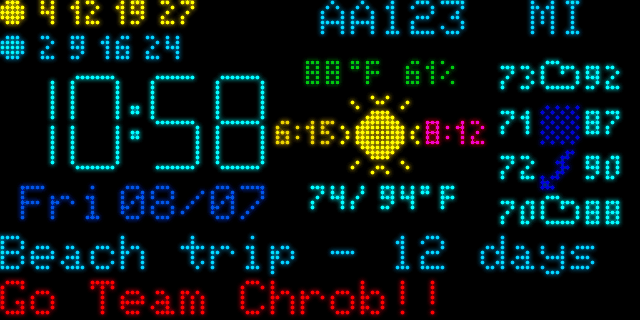
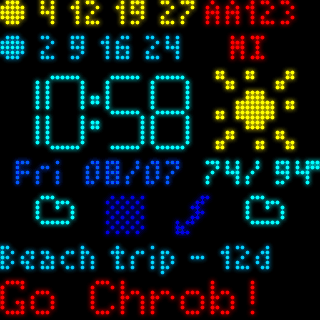

# esp32-morphing-clock

ESP32 HUB75 Matrix Morphing Clock — a clock built on a HUB75 RGB LED matrix, driven by an ESP32.

**Two clocks, one source tree.** This repo builds both a wide 128x64 version and a square 64x64 version from the same code; only geometry, the HUB75 pin map and the weather-panel layout differ. Pick one with `pio run -e 128x64` or `pio run -e 64x64`.

This is a personalized fork of [bogd/esp32-morphing-clock](https://github.com/bogd/esp32-morphing-clock) by [Bogdan Sass](https://github.com/bogd). The hardware, the shield PCB, the enclosure and the morphing clock itself are his work; this fork adds a handful of display sections (transit arrivals, flight info, a calendar countdown), switches the weather source, and adds a nighttime moon phase. See [Differences from upstream](#differences-from-upstream).



*Rendered from the simulator in [`sim/`](sim/), so it shows the layout this code actually
produces rather than a photo that drifts out of date. Regenerate with `cd sim && make readme-gif`.*

## What it displays

The wide 128x64 layout:

* **Morphing clock** — 12-hour `HH:MM`, animated 7-segment morphs between digits (seconds are disabled to reduce CPU load)
* **Day of week and date** (`Mon 04/21`), under the clock
* **Transit arrivals** — top left, two rows of four countdowns, one row per line, each tagged with a colored dot (yellow and blue as shipped)
* **Flight info** — top right, a flight number and its destination code
* **Outdoor temperature and humidity** — received over MQTT from an external sensor; renders in red and reads "No sensor data!" if nothing arrives for 10 minutes
* **Weather** — today's icon (16x16) plus a vertical strip of the next four days, and today's min/max temperature, from [Open-Meteo](https://open-meteo.com/)
* **Moon phase** — between 8 PM and 6 AM, today's weather icon is replaced by the current phase of the moon, computed locally from the date
* **Next calendar event** — bottom line, event name and days remaining
* **Status messages** — startup progress, WiFi/MQTT/OTA state, cleared after 15 seconds

Time is set from NTP at boot and refreshed hourly; weather refreshes hourly.



The square 64x64 shows all of the same sections in a tighter arrangement — most of them in a 3x5 pixel font, the flight destination stacked under the flight number, and the four-day forecast as a horizontal strip of bare icons instead of a vertical column with temperatures. Two things it does not show: **sunrise/sunset** (the wide panel only fits those in the gaps flanking its weather icon) and the **outdoor temperature/humidity** block, which sits off the right edge of the narrower panel.

## What you need

* An **MQTT broker**, plus whatever publishes to it. The clock is a pure consumer — it does not scrape anything itself except the weather. Temperature, humidity, train times, flight info and calendar events all arrive as MQTT messages, so the sections that display them stay blank without publishers. (I feed mine from Home Assistant.)
* **Open-Meteo needs no API key** and is called over plain HTTP.
* A **web server** to host `firmware.bin`, if you want over-the-air updates.

The MQTT topics the firmware subscribes to are listed in [CLAUDE.md](CLAUDE.md#mqtt-topics).

## Building

Requires [PlatformIO](https://platformio.org/). From `code/`:

```bash
pio run                        # build both variants
pio run -e 128x64              # build just the wide clock
pio run -e 64x64               # build just the square clock
pio run -e 128x64 -t upload    # build and flash over USB
pio device monitor             # serial monitor, 115200 baud
```

**A fresh clone will not compile until you create `code/include/creds_mqtt.h`** with your WiFi credentials, MQTT broker details, OTA URL and topic names. It is gitignored and there is no sample file for it — the required macros are listed in [CLAUDE.md](CLAUDE.md#build). If you run both clocks, each needs its own MQTT client id, OTA URL and update topic; the build refuses to produce a 64x64 image without them.

For OTA updates, `code/ota_push.sh <variant>` builds the firmware, checks its size, copies it to your web server and publishes the MQTT message that tells that clock to go fetch it.

There is also a host-side **simulator** in [`sim/`](sim/) that renders the real firmware drawing code to a PNG, with golden-image tests for both variants — useful for checking a layout change without flashing anything. It also produces the animations above (`make readme-gif`).

## Differences from upstream

| | upstream | this fork |
|---|---|---|
| Weather source | AccuWeather | Open-Meteo (no API key) |
| Train arrivals, flight info, calendar countdown | — | added |
| Moon phase at night | — | added |
| Light sensor (TSL2591) | used for display | wired but disabled in code |
| Clock animation | 30ms Ticker | cooperative main loop |

Not implemented, despite being on the original wishlist: automatic brightness from the light sensor, on-screen alerts, and the buzzer. The buzzer and light sensor code is still in the tree but unused.

## Repository layout

* [`code/`](code/) — the firmware (PlatformIO), building both panel variants
* [`sim/`](sim/) — host-side panel simulator and golden-image tests
* [`pcb/`](pcb/) — schematics and gerbers for the matrix shield (v0.3 is current)
* [`case/`](case/) — drawings for the lasercut plexiglass enclosure
* [`CLAUDE.md`](CLAUDE.md) — architecture notes and gotchas

## Changelog

### This fork
* Switched weather from AccuWeather to Open-Meteo
* Added moon phase display during nighttime hours
* Added train arrival, flight and calendar display sections
* Removed the 30ms Ticker in favor of cooperative timing in the main loop, fixing visual glitches and dropped MQTT messages
* Event-based WiFi reconnection
* Added a host-side panel simulator with golden-image tests
* Merged the separate 64x64 clock into this tree as a build variant, so both panels share every fix

### Version 0.2 (upstream)
* Added MQTT SSL support (thanks to [Andreas](https://github.com/lefty01)). Disabled by default.
* Implemented weather forecast — min/max temperature for today, today's + next 4 days' forecast icons
* Decreased light sensor read interval (configurable from config.h)
* Added a watchdog timer to automatically reset the unit

## Thanks

This project would not have been possible without the work of many others, who have been gracious enough to open source their work:

* [Bogdan Sass](https://github.com/bogd), for the entire original project that this is forked from
* The MQTT SSL code contributed by [Andreas](https://github.com/lefty01)
* The PxMatrix library from [2dom](https://github.com/2dom/PxMatrix) — not used here (the DMA library below replaced it, for performance reasons), but it is what got the original project started on HUB75 matrices
* The ESP32 DMA library for controlling the matrix, from [mrfaptastic](https://github.com/mrfaptastic/ESP32-HUB75-MatrixPanel-I2S-DMA)
* The morphing clock code from [HariFun](https://www.instructables.com/Morphing-Digital-Clock/) (modified to work with mrfaptastic's library instead of pxmatrix)
* The shield schematics from [hallard](https://github.com/hallard/WeMos-Matrix-Shield-DMA)
* [Brian Lough](https://www.tindie.com/products/brianlough/esp32-i2s-matrix-shield/), who was extremely helpful during the original project's early work, and who sells a finished shield if you would rather not build one

And, of course, all the authors of the various open source libraries.

## License

The ESP32 HUB75 Matrix Morphing Clock is (c) [Bogdan Sass](https://github.com/bogd), licensed under the GNU General Public License Version 3.0 (which means, if you use it in a product somewhere, you need to make the source and all your modifications available to the receiver of such product so that they have the freedom to adapt and improve). Modifications in this fork are released under the same license.
